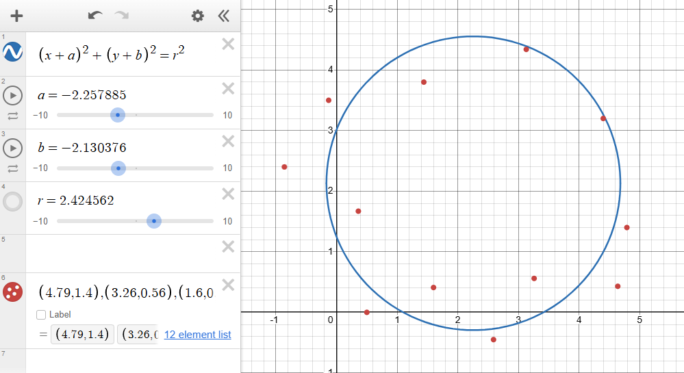

# Circle of Best Fit - Gradient Descent



![[training_loss.png]]

## How to Build and Run

1. Clone the repo
2. From the `src/` folder, run:
   ```
   gcc main.c gradient.c io.c -o circle_fit -lm
   ./circle_fit
   ```
3. To generate the convergence plot:
   ```
   python plot_convergence.py
   ```

Requires a C compiler (gcc/clang) and Python with matplotlib + pandas installed.


## What is Loss?
As with any gradient descent, we need a "Loss" function which tells us, given our current parameters, how far off we are from a perfect fit to our dataset.

We will measure Loss with the sum of the squared errors, where the error for any given point is the distance between that point and our current circle's edge. The total Loss is the sum of these squared errors.

For a circle $\left(x-2\right)^{2}+\left(y-3\right)^{2}=1$, the error of the point $(5,5)$ is ~$2.60556$:

![[squared_error_visual.png|279]]

## Writing Our Loss Function

Now, we must write the sum of the squared errors as a function of $a$, $b$, and $r$, corresponding to a circle written in the form $\left(x+a\right)^{2}+\left(y+b\right)^{2}=r^{2}$

First, we need a way to calculate the distance of any point $\left(x_{i},y_{i}\right)$ given $a$, $b$, and $r$

The distance between the center of our circle to any point can be written as their Pythagorean distance $\sqrt{\left(x_{i}+a\right)^{2}+\left(y_{i}+b\right)^{2}}$, then we can subtract $r$ to get the distance between the edge of our circle and the point.

This makes our expression for squared error:
$$\left(\sqrt{\left(x_{i}+a\right)^{2}+\left(y_{i}+b\right)^{2}}-r\right)^{2}$$

Since our Loss function is the sum of our squared errors:

$$L\left(a,b,r\right)=\sum_{i=1}^{n}\left(\sqrt{\left(x_{i}+a\right)^{2}+\left(y_{i}+b\right)^{2}}-r\right)^{2}$$

## Computing the Partial Derivatives

We will now analyze how changing different variables affects the Loss function, with the ultimate goal being to minimize Loss. We must find how changing each variable, $a$, $b$, or $r$ affects Loss, and 
we do this by assembling our Loss gradient vector:

$$∇L=\left(\frac{∂L}{∂a},\frac{∂L}{∂b},\frac{∂L}{∂r}\right)$$

Each component of the vector tells us how Loss would change if we changed each variable. For example, the partial derivative $\frac{∂L}{∂a}$ describes how Loss changes when $a$ changes. If $\frac{∂L}{∂a}$ > 0, that would mean increasing $a$ would lead to an increase in Loss, suggesting that we should decrease $a$ to minimize loss. 

Recall our Loss function:
$$L\left(a,b,r\right)=\sum_{i=1}^{n}\left(\sqrt{\left(x_{i}+a\right)^{2}+\left(y_{i}+b\right)^{2}}-r\right)^{2}$$

Taking the partial derivative of Loss with respect to $a$ via the Chain Rule:

$$\frac{∂L}{∂a}=\sum_{i=1}^{n}2\left(\sqrt{\left(x_{i}+a\right)^{2}+\left(y_{i}+b\right)^{2}}-r\right)\cdot\frac{1}{2}\left(\left(x_{i}+a\right)^{2}+\left(y_{i}+b\right)^{2}\right)^{-\frac{1}{2}}\cdot2\left(x_{i}+a\right)$$

Simplifying,
$$
\frac{∂L}{∂a}=\sum_{i=1}^{n}\frac{2\left(x_{i}+a\right)\left(\sqrt{\left(x_{i}+a\right)^{2}+\left(y_{i}+b\right)^{2}}-r\right)}{\sqrt{\left(x_{i}+a\right)^{2}+\left(y_{i}+b\right)^{2}}}
$$

Similarly,

$$\frac{∂L}{∂b}=\ \sum_{i=1}^{n}\frac{2\left(y_{i}+b\right)\left(\sqrt{\left(x_{i}+a\right)^{2}+\left(y_{i}+b\right)^{2}}-r\right)}{\sqrt{\left(x_{i}+a\right)^{2}+\left(y_{i}+b\right)^{2}}}$$
Lastly,

$$\frac{∂L}{∂r}=-2\sum_{i=1}^{n}\left(\sqrt{\left(x_{i}+a\right)^{2}+\left(y_{i}+b\right)^{2}}-r\right)$$

Now, we've assembled $∇L$. Note that we do not need the coefficient $-2$.


## Updating Parameters Using Our Gradient Vector

Recall that each partial derivative tells us which direction to adjust a parameter in order to minimize Loss. 

To update $a$:
$$a \leftarrow a - \eta \frac{\partial L}{\partial a}$$

Where $\eta$ is our Learning Rate, which tells our model how aggressively to update parameters according to our gradient. I've used $\eta = 0.01$ in the code.

The model may take longer to converge with lower learning rates, and may overshoot the optimal parameters with higher learning rates.

To update $b$ and $r$:

$$b \leftarrow b - \eta \frac{\partial L}{\partial b}$$
$$r \leftarrow r - \eta \frac{\partial L}{\partial r}$$

These three updates are applied until we've reached approximately the minimum loss, or until `MAX_ITERATIONS` times, set to `100 000` by default.
We can approximate when we've reached the minimum loss by checking if the change in loss between the current and previous iteration is negligable. In other words, if:
```
fabs(loss - previous_loss) < EPSILSON
```
Where `EPSILSON` is defined as 1e-9.

Coding time...
